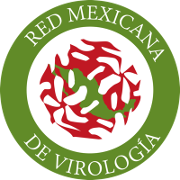

    
    
    
    

# Curso Virtual de Metagenómica 2025

## Organizadores y Profesores 
* Dr. Sonia Dávila, CIDC
* Dr. Hugo Castelán-Sánchez, Western University 

1. [Introducción General](#Introducción-General)
2. [Schedule](#Schedule)
    - [Monday](#Lunes)
    - [Tuesday](#Tuesday)
    - [Wednesday](#Wednesday)
    - [Thursday](#Thursday)
    - [Friday](#Friday)
3. [Target group](#target-group)
4. [Learning outcomes](#learning-outcomes)

## Introducción general 
La composición, variedad y distribución de las comunidades microbianas son aspectos cruciales para entender la evolución, adaptación y población de microoganismos. Con la accesibilidad y rentabilidad creciente de la secuenciación de alto rendimiento, analizar poblaciones microbinas a nivel del metagenoma brinda una resolución para explorar la evolución dentro de los huéspedes, la historia de transmisión y la estructura poblacional. La metagenómica se ha establecido como la metodología principal para analizar el contenido genético de las comunidades microbianas. Durante este curso de una semana, se enseñarán y aplicarán técnicas bioinformáticas para estudiar comunidades microbianas utilizando enfoques metagenómicos. 
El objetivo es adquirir familiaridad con las herramientas de análisis bioinformático y aprender a aplicarlas en investigaciones propias tras finalizar el curso.

- [Monday](#Lunes)
  Introduccion a Linux 
- Repaso Histórico
- GNU/Linux
- Interfaces
- Línea de Comandos
- Comandos de sistema
- Operaciones con archivos de texto
